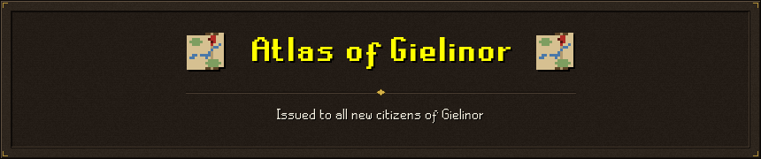
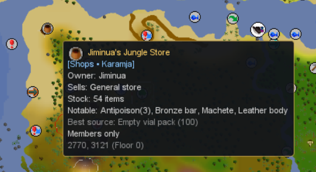
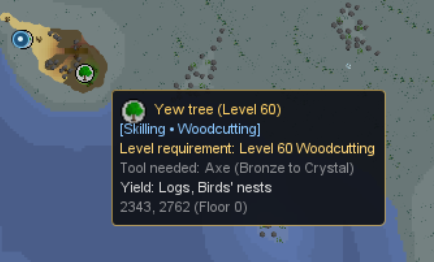
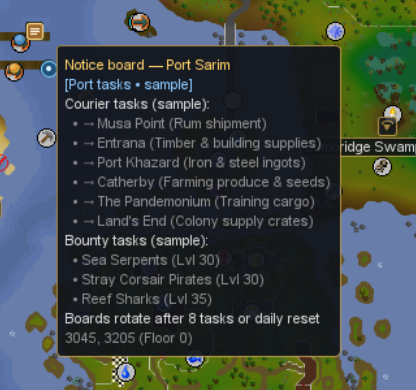
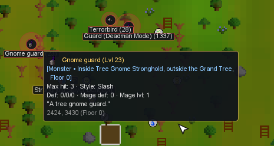
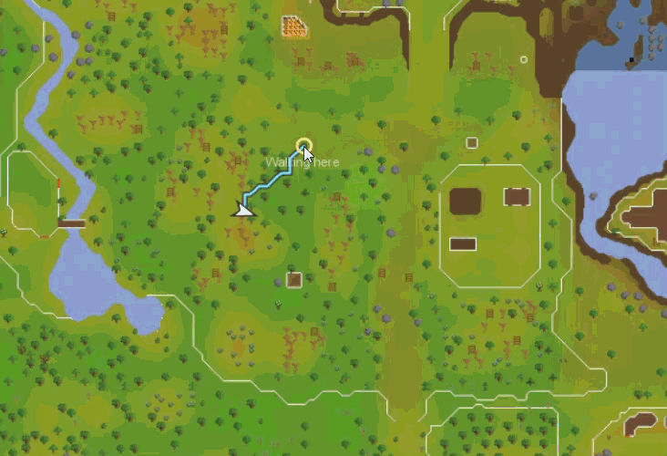

> **Atlas of Gielinor**  
> *Examine: An cartographer's parchment charting the surface and underground realms of Gielinor.*

A RuneLite plugin that replaces the in-game world map. Dungeon locations, clippings, and other elements are hand placed and edited. Otherwise data is pulled from the OSRS Wiki, with some manual curation. The plugin is designed to be a drop-in replacement for the RuneLite world map, with no other changes to the game. Enable **Download map assets** in Atlas of Gielinor settings to trigger download [Atlas of Gielinor asset pack](https://raw.githubusercontent.com/n-oost/better-map-assets/main/channels/tiles-v1.json).

Missing or invalid assets display `NO MAP DATA` with a loading or error message. Updates are checked at startup while downloads are enabled. Toggle **Download map assets** off and on to retry map download on fail.

## AI-Disclosure
Plugin was created with the help of AI tools. The author has verified the code and is responsible for its content. Map imagery is downloaded from the linked asset pack; there are no runtime calls to the Wiki API.

## Features

### Settings

Common settings are grouped under **Map**, **Controls**, **Search & tooltips**, **Map layers**, and
**Routing**. Each **Advanced** section starts collapsed and contains appearance, marker detail,
transport, or calculation controls. Dungeon tuning and diagnostics share one collapsed
**Developer** section. Turn the plugin off to restore RuneLite's normal world map.

### Surface and underground on one map
Better Overworld / Underworld map and control.

<!--  -->

### Zoom from the whole world to one tile

Atlas of Gielinor owns the camera: 0.14 to 24 pixels per game tile. Drag to pan, scroll to zoom about
the cursor, right click to step back out.

### Closing the map

Click the game's original map close button. It remains visible and clickable in fullscreen
and while map assets are unavailable. Atlas does not provide a replacement close chip or
close the map after a Finder selection. Escape follows the client's native behavior;
when a boss gallery is open, Escape dismisses that gallery first.

### Raid boss galleries

Click **CoX · Bosses**, **ToB · Bosses**, or **ToA · Bosses** at the respective raid entrance to open its six boss cards. Hover a card for its boss tooltip; hold your configured tooltip expansion modifier for available combat details. Press **Esc** or click **×** to close the gallery. Enable **Show boss locations** and **Show tooltips** in Atlas of Gielinor settings.

### Hover cards

Hover anything on the map for shop stock, POI names, monster details (combat level, slayer level,
slayer masters, weakness strategies, key drops), travel directories, coordinates and markers.

| Shop stock | POI details |
| :---: | :---: |
|  |  |
| **Notice board** | **Monster details** |
|  |  |

### Dungeon entrances

Hover dungeon entrances to view the dungeon map, location details, and available actions directly
from the map.

### Find

Search locations, monsters, shops and ground-item spawns by name, from the in-map Find card or
from the quick-find orb by the minimap (drag it to reposition, click to open). Type location, monster, shop, item. Click or hit enter to select a destination, then click the native world-map orb to display it. Route calculates a path to the destination and displays it when you open the map. Can work with shortest route plugin.

### Walking routes

Atlas of Gielinor calculates and draws its own route line using a pinned copy of the
[Shortest Path](https://github.com/Skretzo/shortest-path) engine and map data by Skretzo and
contributors (BSD 2-Clause). Choose a mode in **Routing (Shortest Path by Skretzo)**:

- **Use external plugin settings** requires Shortest Path to be enabled separately. Atlas of Gielinor reads
  its saved routing settings and sends it the selected destination for its own in-game route.
  If the external plugin is disabled, routing pauses instead of falling back to local settings.
- **Use Atlas of Gielinor routing** uses the bundled fork and Atlas of Gielinor's own routing settings.
  It does not read settings from the external plugin. If Shortest Path is enabled, Atlas of Gielinor
  sends it the selected destination so its route also appears in game.

Enabling either mode disables the other; both off disables routing.
The two plugins calculate their routes independently, so differences are possible when their
engine or collision-data revisions differ.

### Monster zones

805 monsters across 2,310 location zones, each drawn as one marker at the centroid of its spawn
tiles, with the spawn area shaded behind it.

### Ground item spawns

370 items over 4,361 exact world tiles, drawn as their real item sprites once you zoom past
`groundItemMinZoom` (default 9 px/tile) and filtered by the `groundItemMinValue` gp slider
(default 0, so everything shows).

<!--  -->

### Travel networks

Charter ships and other transport hubs, with route arcs between them and a directory on the
hover card.

### Markers from other plugins

Markers registered by other RuneLite plugins ( clue scrolls, party
members,quest helper) are drawn on Atlas of Gielinor's camera, along with the player orientation arrow.

<!--  -->

### Plugin Hub notes

- No reflection, no AWT-level input hooks, and no native code.
- With **Download map assets** enabled, the plugin checks the remote channel at startup and downloads changed packs using asynchronous OkHttp. Installed files use RuneLite Filepath in the plugin directory.
- The plugin replaces the world map only. It does not touch the HUD minimap, the status orbs, or
  any other game component.
- The tile cache is budgeted in megabytes, not tiles: ~49 MB of LRU plus ~30 MB of permanently held
  coarse levels.
- The Finder's search field takes keys through RuneLite's `KeyManager`.

## Datasets
-Data is bundled in `resources/com/bettermap/data`.
- **Monster locations**: 805 monsters across 2,310 location zones in `monsters.json.gz`.
- **Shops**: ~450 shops from OSRS Wiki `Category:Shops` in `shops.json.gz` (owner, special stock,
  notable items, services).
- **Ground item spawns**: 370 unique items over 4,361 exact world tiles. Runtime dataset
  `ground_items.json.gz` (gzip-compressed; loaders decompress on read); full scrape in
  `docs/data/ground_item_spawns.tsv` and `docs/data/ground_item_data_complete.json`. 
- **Points of interest**: current cache world-map icons (`poi/pois.tsv`), older unmatched wiki markers (`poi/pois-legacy.tsv`), curated additions, and cache region labels
  (`poi/pois-cache.tsv`).
- **Travel networks**: charter ships and other transport hubs. Runtime dataset `travel_networks.json.gz` from manually curated wiki nodes and routes.

## Credits
- n-oost, truenosus
- **[RuneLite](https://runelite.net)** - plugin API and client.
- **[Skretzo and Shortest Path contributors](https://github.com/Skretzo/shortest-path)** -
  route engine and map data, BSD 2-Clause. See [third-party notices](THIRD-PARTY-NOTICES.md).

## License

BSD 2-Clause, see [`LICENSE`](LICENSE). Third-party code bundled in `src/main/java/com/bettermap/pathfinding`
is covered by [`THIRD-PARTY-NOTICES.md`](THIRD-PARTY-NOTICES.md).
